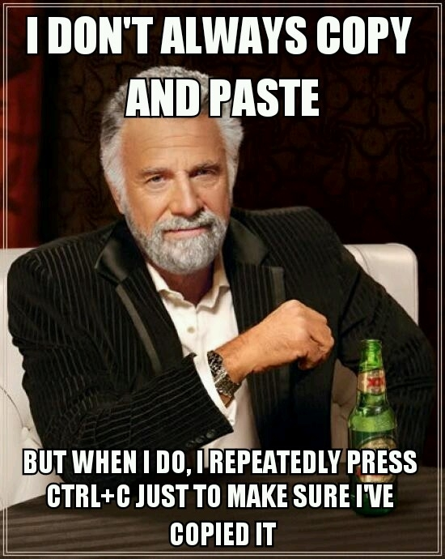

# repograde

Tools for Grading Programs in GitHub Repositories

This is a set of shell scripts to automate tasks for 
evaluating and making changes 
to a large set of repositories. 
The cast includes: 

## The Cleaner

If you need to solve a problem, he's the guy to call. 

## The Checker

If you want to know what's there, this guy will find it. 

## The Cloner

If you need to produce a lot of clones, this is where to go.

## The Copier

I don't always need to copy multiple files...
but when I do I use this script. 

## The Puller

This is what you need to pull large amounts of new products. 

## The Sender

This guy will put you in your place. 

## The Runner

This runs...computer programs. 

## The Pusher

When the work is done, push your changes and cruise away into the sunset. 

